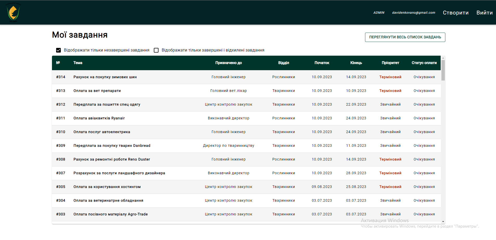
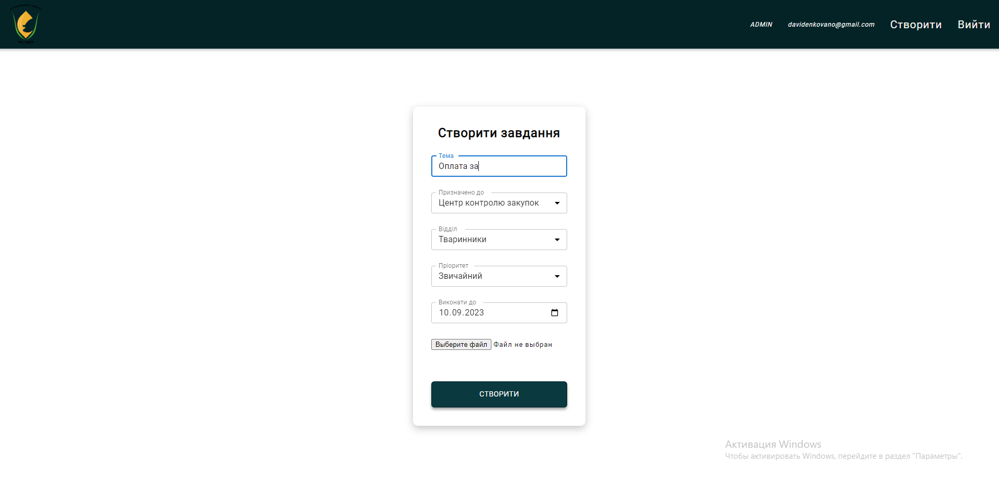
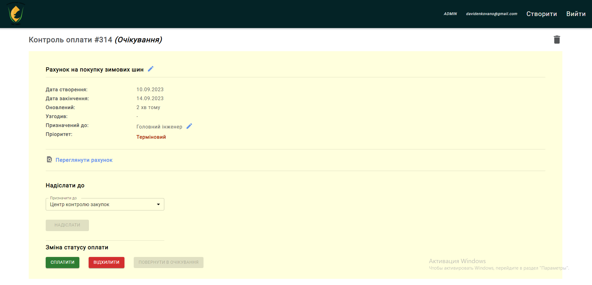

# Invoices App :scroll:

### Description :memo:
The project "Invoices App" was created to simplify the signing and processing of invoices by the company's internal team. The application automates the process of signing, transferring, and storing documents. Additionally, it provides convenient and fast access to information and contributes to increasing the efficiency and accuracy of invoice processing.

### Technologies in the project :man_technologist:
 - React
 - TypeScript 
 - Redux Toolkit
 - Express
 - MongoDB
 
 ### Getting Started with Invoices App :runner:
 
 #### npm run dev
 Runs server side  
 http://localhost:5000
  
 #### npm start
 Runs client side  
 Open http://localhost:3000 to view it in the browser.
 
 
 
 